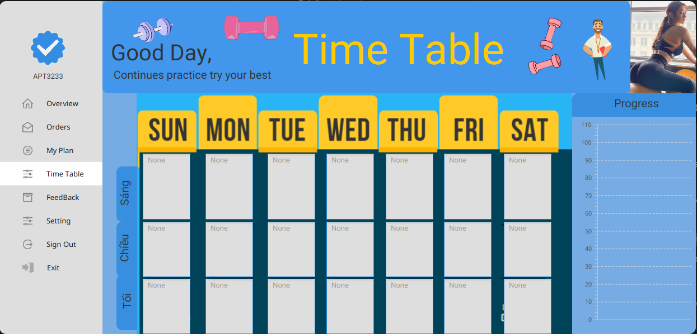

# Thống kê **Fitness Application**

## Công nghệ & Framework
- **Frontend**:
    - JavaFX
    - HTML(response từ server)
- **Backend**:
    - Java 
    - C(webserver)
- **Framework**:
    - <code>mysql-connector-java</code>
    - <code>HikariCP</code>
    - <code>javafx-fxml</code>

## Nguyễn Khắc Anh
- **Chức vụ**: Team Lead

- **Nhiệm vụ**
    + Xây dựng Base App
    + Quán lý nhóm 
    + Đánh giá/phân tích và cải tiến App
    + Hỗ trợ kỹ thuật
    + <strong>Khuyến khích mọi nguời sáng tạo và cùng nhau phát triển</strong>

- **Thành tích**
    + Không 1 ai bị bỏ lại phía sau !

## Nguyễn Bình Vương
- **Chức vụ**: UI User Panel

- **Học được**:
    + Java và FXML: Qua khóa học, tôi đã nắm được cách sử dụng Java kết hợp với FXML trong JavaFX để xây dựng giao diện người dùng một cách trực quan và dễ dàng hơn. 
    + Cơ sở dữ liệu SQL: Tôi đã làm quen và nắm vững cách sử dụng SQL để quản lý cơ sở dữ liệu, từ việc tạo bảng, thiết lập các khóa chính và khóa ngoại đến truy vấn dữ liệu một cách hiệu quả
    + Sử dụng Git để quản lý dự án, theo dõi thay đổi qua các giai đoạn.

- **Thực hiện**:
    + Thiết kế Class Diagram để mô tả cấu trúc ứng dụng.
    + Thiết kế giao diện Setting để quản lý các cài đặt của ứng dụng.
    + Thiết kế giao diện overview để giới thiệu khóa học, quảng cáo, menu.
    + Thiết kế giao diện myplan để hiển thị về khóa học, nội dung, huấn luyện viên
    + Xử lý dữ liệu đầu vào, dầu ra

## Tô Đình Văn
- **Chức vụ**: UI User Panel <code>Time Table</code>

- **Học được**:
    + Phát triển kỹ năng sử dụng FXML để xây dựng giao diện người dùng trực quan và linh hoạt
    + Làm việc với SQL để quản lý cơ sở dữ liệu, giúp lưu trữ và truy xuất thông tin người dùng một cách hiệu quả.
    + Cải thiện khả năng lập trình Java, trong việc kết hợp các thành phần giao diện và dữ liệu .
    + Học cách sử dụng Git để quản lý dự án, giúp theo dõi các thay đổi qua từng giai đoạn .

- **Thực hiện**:
    + Thiết Kế , Vẽ Sơ Đồ (Class Diagram )
    + Thiết Kế giao diện Setting
    + Xử lý dữ cho phép người dùng Update Profile, thông báo lỗi nếu dữ liệu đầu vào chưa chính xác
    + Thiết Kế Giao diện Servey, khi người dùng chọn mua 1 khóa học sẽ thực hiện làm 1 khảo sát để đánh giá và sắp xếp thời khóa biểu.
    + Thiết Kế Giao diện Time Table , cho phép hiển thị lịch học từng tuần của học viên (Nếu có)

## Nguyễn Tân Tiến
- **Chức vụ**: UI Admin Panel 

- **Học được**: 
    + Làm quen với FX
    + Làm việc với database
    + Kỹ năng làm việc nhóm
    + Quản lí project qua git

- **Thực hiện**:
    + Thiết kế model
    + Xử lí dữ liệu từ database tới giao diện admin

## Demo 
1. Login Panel

2. Admin Panel
    
    

    
    

    
    

    
    

3. User Panel
    
    

    
    

    
    

    
    

    
    

    
    

### END